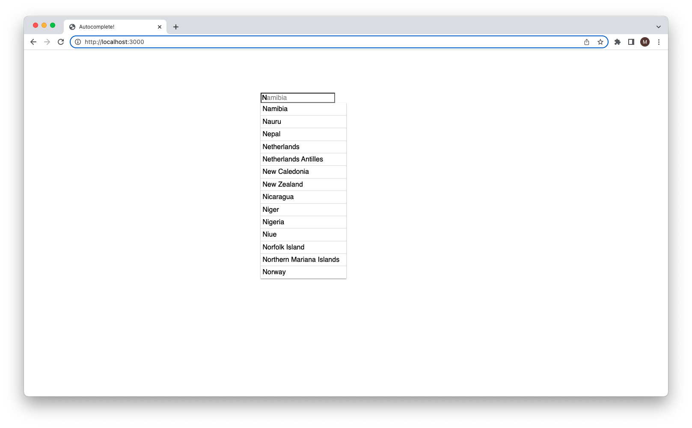

# Autocomplete

Application that autocompletes country names. Built using `JS` and `express`.

## About

The useful part of this application is the autocomplete functionality. Although used with countries here, `autocomplete.js` contains the generic class for use in other projects.

## How to use

1. Clone the repo using: https://github.com/Sinkinson/autocomplete.git
2. `cd` into the directory
3. Run `npm install` to install dependencies
4. Run `npm start` to start the application
5. Navigate to the application via `http://localhost:3000`

## Example usage

